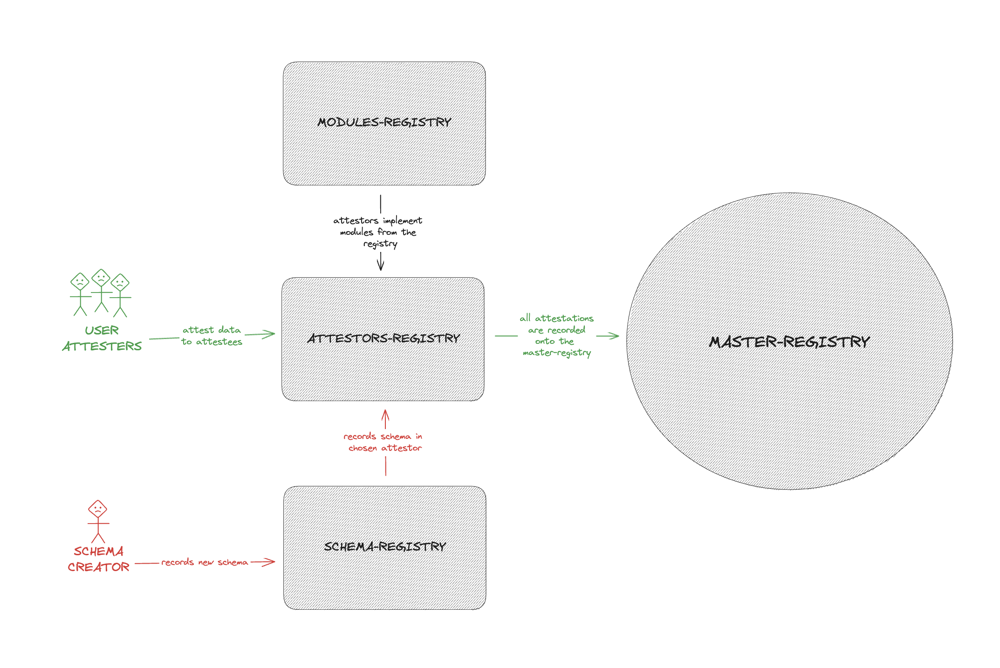
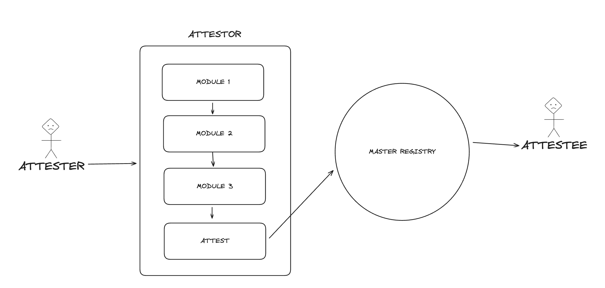

# LINEA ATTESTATIONS REGISTRY

DISCLAIMER:
Please be advised that this repository is under development and has not undergone comprehensive testing. It may contain bugs or unfinished features. As such, it is not suitable for production use.

This repository serves as a blueprint for the potential structure of the Linea Attestation Registry. Its modular design encourages contribution and development of various features and components. Moreover, it ensures seamless cross-compatibility with a wide array of protocols and standards, including but not limited to, EAS, SBTs, and zkBadges.

A set of very basic example Modules can be found in the modules directory.

Showcasing an example of:

- paid attestations
- Privacy preserving attestations
- EAS compatible attestations
- Constrained attestations

## Getting Started

```bash
    forge install
```

```bash
    forge build
```

```bash
    forge test
```

```bash
    forge coverage
```

## Design




Following this architecture, any user can:
1. create or chose a schema from the schema registry.
1. create or chose one or many modules from the modules registry and combine them within an attestor. 
3. register the attestor to the attestors registry.
4. anyone can now attest attestations through the attestor with logic validation from the modules.

## Vocab

Attestor: A gateway that implements custom business logic prior to submitting attestations to the MasterRegistry.

Module: A unit of functionality that enhances attestation processes, such as privacy controls, fee checks etc.

Schema: A template that dictates the structural format of attestation data.

Attestation: An entry of structured data, associated with a specific address, stored in the MasterRegistry.

## Relationships

### Attestor - Schema

**Many-To-Many**. An Attestor can handle many Schemas, and a Schema can be used by many Attestors. This relationship allows for the attestation of various types of data, as each Schema defines the structure of a unique type of data.

### Attestor - Module
**Many-To-Many**. An Attestor can implement many Modules, and a Module can be implemented by many Attestors. This allows Attestors to incorporate diverse functionalities into their operations, as each Module contains a different piece of business logic.

### Schema - Attestation
**Many-To-One**. A Schema can have many Attestations, but an Attestation can only have one Schema. This means that each Attestation adheres to the structure defined by one specific Schema.

### Attestation - Attestor
**One-To-Many**. An Attestor can generate many Attestations, but each Attestation is generated by a single Attestor. This is because Attestors serve as the gateways for attesting data to the attestation layer.

### Module - Attestation
**Many-To-Many**, through the intermediary of an Attestor. A Module can be used to process many Attestations (as part of an Attestor's logic), and an Attestation can be processed by many Modules (again, as part of an Attestor's logic).

Please note that these are the relationships based on the current structure of the system. Any changes to the design or functionality may affect these relationships.

## Components

### Master Registry

This registry serves as a repository for all attestation instances. Its primary role is to:

- Record and maintain all attestations.

### Schemas Registry

The Schemas Registry outlines and holds the structure of the attestation data, playing a pivotal role in data representation. It is tasked with:

- Recording and storing all schemas, which define the structure and representation of attestation data

### Attestors Registry

The Attestors Registry functions as the portal for attesting data to the master registry. Attestor smart contracts need to adhere to certain standards, including:

- Being capable of handling an array of modules
- Validating every module for each attestation before affirming the data
- Inheriting from the "Attestor" base contract

### Modules Registry

The Modules Registry is the space where smart contracts implementing specific business logic, known as modules, are stored. Each module must meet the following criteria:

- Be recorded in the Module Registry
- Inherit from the "Module" base class
- This layered and organized structure allows for seamless integration and facilitates the management and verification of attestations.

## Building and registering a Module

Modules are a way of creating and sharing new features to users of the Attestation layer.

Steps:

1.  Import the "Module" base contract into your module and make sure it is inherited by your contract.

    ```solidity
    import "../base/Module.sol";

    contract NewModule is Module {}
    ```

2.  Your module must implement the base contract's constructor. Provide the correct addresses to the required registries.

    ```solidity
    constructor(
        MasterRegistry _masterRegistry,
        SchemasRegistry _schemasRegistry,
        AttestorsRegistry _attestorsRegistry
    ) Module(_masterRegistry, _schemasRegistry, _attestorsRegistry) {}
    ```

3.  Your module must override and provide an implementation for the run function. This is the function that will be called by Attestor contracts to run the module logic.

    ```solidity
    function run(
        Attestation memory attestation,
        uint256 value,
        bytes memory data
    ) external view override returns (bool) {
        // implement logic here
        return true;
    }
    ```

The function takes three parameters:

- The attestation struct
- The value (WEI) sent to the module
- An array of bytes (additional data) which may be used for custom module logic

4. Once you have deployed your Module to the blockchain, you must register it in the ModulesRegistry for it to be useable on the Attestation Layer.

Using ethers.js

```
    await modulesRegistry.registerModule(/* your module address */)
```

Verify your module has been registered.

```
    const registered = await modulesRegistry.isRegistered(* your module address */)
```

## Building and registering an Attestor

Attestors are smart contract gateways to attesting data to the attestation layer (only registered attestors can call the "attest" function of the master registry). Users can build and register their own attestors or use existing attestors.

Steps:

1.  Import the "Attestor" base contract into your Attestor and make sure it is inherited by your contract.

    ```solidity
    import "../base/Attestor.sol";

    contract NewAttestor is Attestor {}
    ```

2.  Your attestor must implement the base contract's constructor. Provide the correct addresses to the required registries and the modules you wish your attestor to use.

    ```solidity
    constructor(
        MasterRegistry _masterRegistry,
        SchemasRegistry _schemasRegistry,
        ModulesRegistry _modulesRegistry,
        address[] memory _modules
    ) Attestor(_masterRegistry, _schemasRegistry, _modulesRegistry, _modules) {}

    ```

3.  The "Attestor" base contract has 4 hooks that you can implement.

- \_beforeAttest
- \_afterAttest
- \_beforeUpdate
- \_afterUpdate

  These hooks are called in the "attest", "attestBatch", "update" and "updateBatch" functions of the Attestor. An example implementation of the \_beforeAttest hook is shown below:

```Solidity
    function _beforeAttest(
        Attestation memory attestation,
        uint256 value,
        bytes[] memory data
    ) internal override {
        bool owner = $masterRegistry.hasAttestation(
            attestation.attestee,
            attestation.schemaId
        );
        if (owner) revert AlreadyAttested();
        for (uint256 i = 0; i < $modules.length; i++) {
            if (!Module($modules[i]).run(attestation, value, data[i]))
                revert ModuleFailed($modules[i]);
        }
    }
```

4. Once you have deployed your Attestor to the blockchain, you must register it in the AttestorsRegistry for it to be useable on the Attestation Layer.

Using ethers.js

```
    await attestorsRegistry.registerAttestor(/* your attestor address */)
```

Verify your module has been registered.

```
    const registered = await attestorsRegistry.isRegistered(* your attestor address */)
```
